

# MAHRM AI
### Forward Deployed Engineering, Exported from Qatar

**An applied-AI venture** that builds and exports elite Forward Deployed Engineering — deploying trustworthy, sovereign AI for institutions at home and abroad.

[Website](https://mahrmai.com) · [LinkedIn](https://www.linkedin.com/in/al-hasanat-r-a410829) · [GitHub](https://github.com/hasanatrasul) · [AI sample video](https://youtu.be/k65LSxTmIHA)

---

## About

MAHRM AI is built on one scalable engine: a cadre of elite **Forward Deployed Engineers (FDEs)** who embed with clients to turn complex, high-stakes problems into deployed, trustworthy AI systems. We serve Qatari institutions first — government, regulators, banks, and justice bodies — then **export the capability abroad to earn foreign exchange for Qatar**. Reusable platforms built during delivery become licensed B2G/B2B SaaS, and an FDE academy grows local talent.

Founded by **Al Hasanat Rasul** — M.Sc. Artificial Intelligence (Sweden, Distinction), founder and former Acting Director General of a national forensic agency, lab-builder, and hands-on engineer. Public, verifiable builds are at **[github.com/hasanatrasul](https://github.com/hasanatrasul)**.

---

## 📊 Pitch Deck

*Scroll through the deck below, or [download the PDF](MAHRM_AI_Pitch_Deck.pdf).*

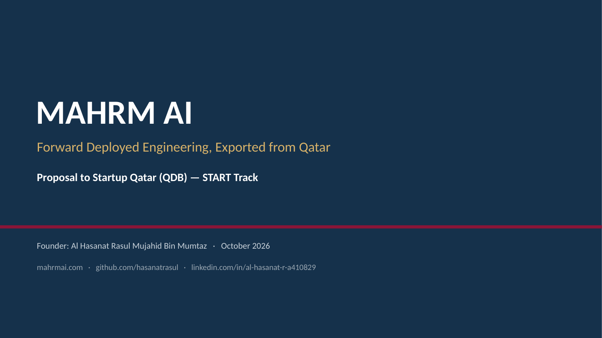
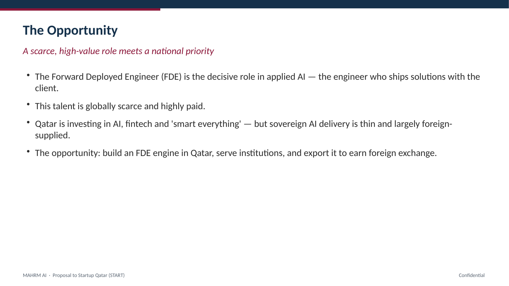
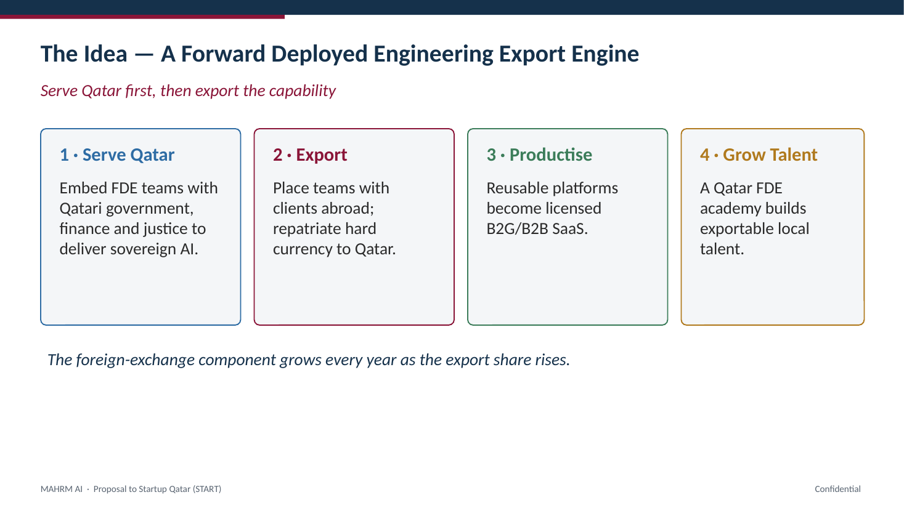
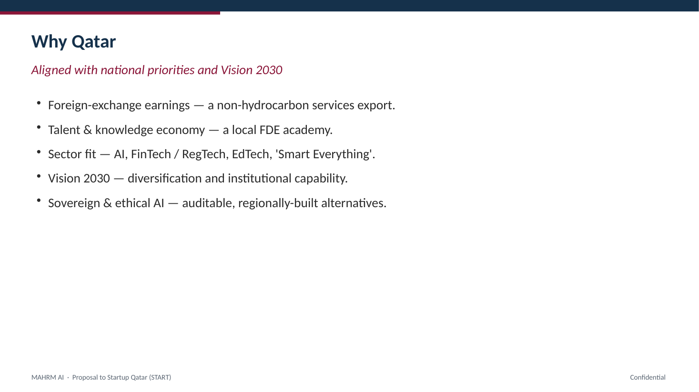
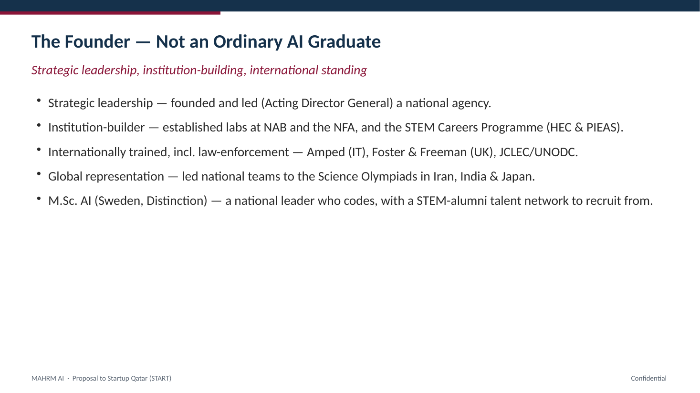
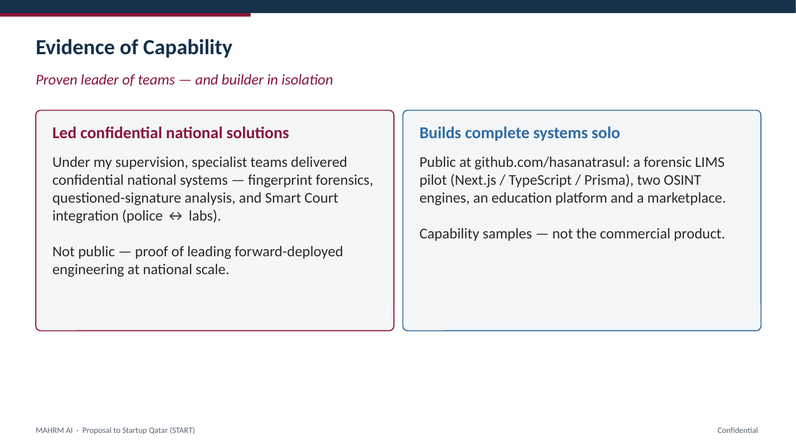
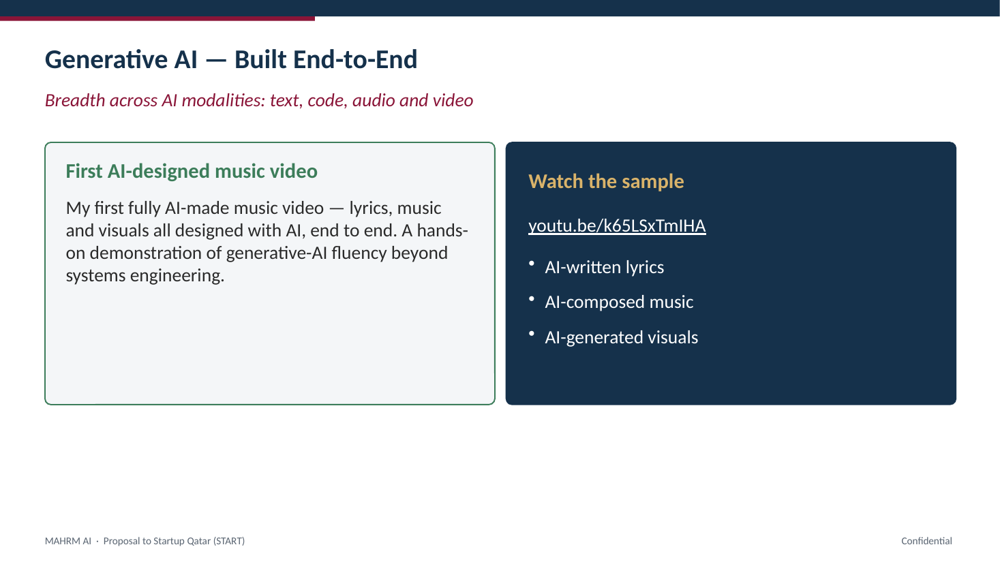
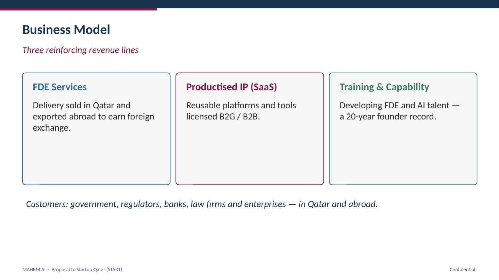
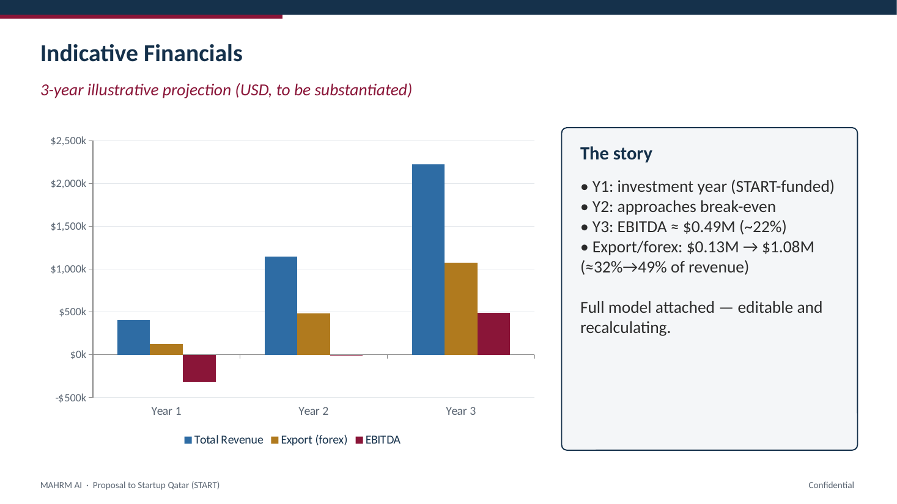
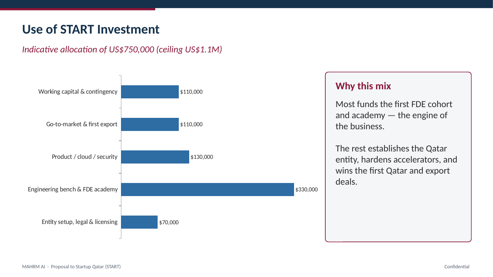
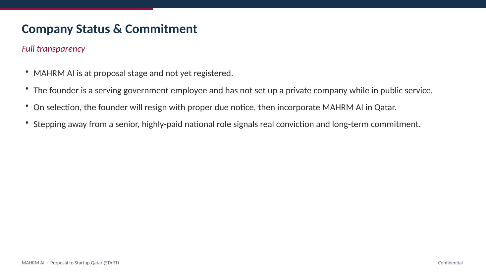
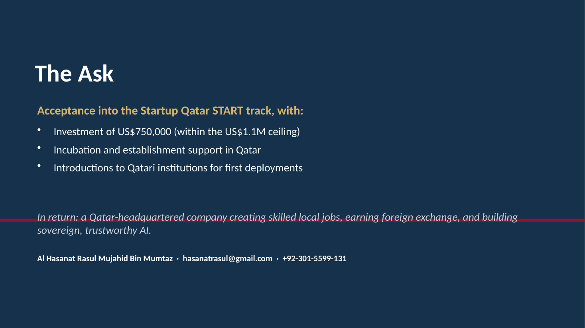

---

## Highlights

- **Core model:** build & lead Forward Deployed Engineers from a Qatar base; serve locally, export abroad for foreign exchange.
- **Domains:** forensic, fraud & financial-crime intelligence (RegTech), digital evidence, investigation workflow — plus generative AI.
- **Proof:** a national-scale forensic LIMS (Next.js · TypeScript · Prisma), two OSINT engines, live public products, and an [AI-made music video](https://youtu.be/k65LSxTmIHA) — all built by the founder.
- **Stage:** early-stage, seeking Startup Qatar START-track support to establish in Qatar.

> Some systems the founder has led are confidential national deployments and are referenced, not disclosed. The public repositories demonstrate individual build capability, not the company's commercial product.

---

## Contact

**Al Hasanat Rasul Mujahid Bin Mumtaz** — Founder
📧 hasanatrasul@gmail.com · 🌐 [mahrmai.com](https://mahrmai.com) · 💼 [LinkedIn](https://www.linkedin.com/in/al-hasanat-r-a410829)

Full proposal and financial model available on request.
